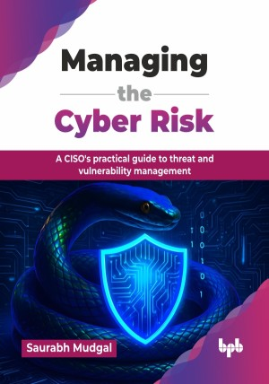

# Managing the Cyber Risk

A CISO's practical guide to threat and vulnerability management.

This is the repository for [Managing the Cyber Risk
](https://bpbonline.com/products/managing-the-cyber-risk?variant=44633686212808),published by BPB Publications.

## About the Book
In today's ever-expanding digital world, cyber threats are constantly evolving, and organizations are struggling to keep pace. Managing the Cyber Risk equips CISOs and security professionals with the knowledge and strategies necessary to build a robust defense against these ever-present dangers.

This comprehensive guide takes you on a journey through the evolving threat landscape, dissecting attacker motivations and methods, and recognizing modern dangers like AI-driven attacks and cloud vulnerabilities. You will learn to quantify the real-world cost of cybercrime, providing a clear justification for robust security measures. The book guides you through building a powerful vulnerability management program, covering asset discovery, scanning techniques (including penetration testing and threat intelligence integration), in-depth risk analysis using CVSS, and effective prioritization and remediation strategies. Cultivating a security-aware culture is paramount, and you will explore employee training, incident response planning, the crucial roles of security champions and SOCs, and the importance of measuring security program effectiveness. Finally, it teaches advanced techniques like continuous threat detection and response, deception technologies for proactive threat hunting, integrating security into development pipelines with DevSecOps, and understanding future trends shaping cybersecurity.

By the time you reach the final chapter, including the invaluable CISO's toolkit with practical templates and resources, you will possess a holistic understanding of threat and vulnerability management. You will be able to strategically fortify your digital assets, proactively defend against sophisticated attacks, and confidently lead your organization towards a state of robust cyber resilience, truly mastering your cyber risk management.

## What You Will Learn
• Grasp evolving threats (malware, AI), cybercrime costs, and VM principles comprehensively.

• Analyze attacker motivations, vectors (phishing, SQLi), and modern landscape intricacies.

• Establish a vulnerability management program tailored to your organization's specific needs.

• Foster a culture of security awareness within your workforce.

• Leverage cutting-edge tools and techniques for proactive threat hunting and incident response.

• Implement security awareness, incident response, and SOC operations technically.

• Understand future cybersecurity trends (AI, blockchain, quantum implications).
